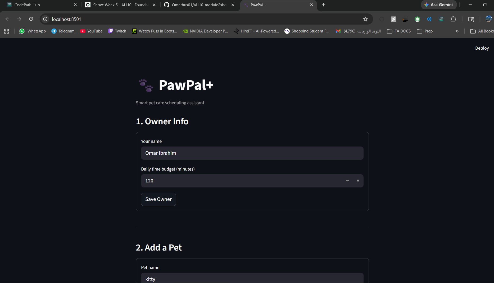
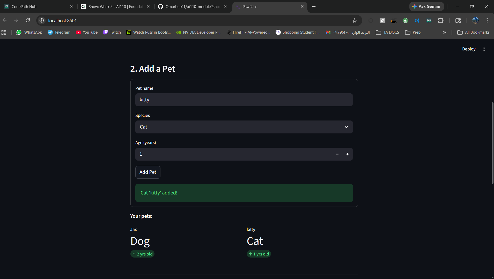
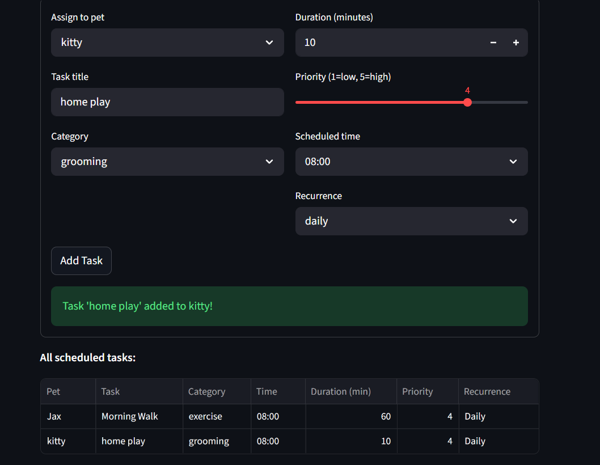
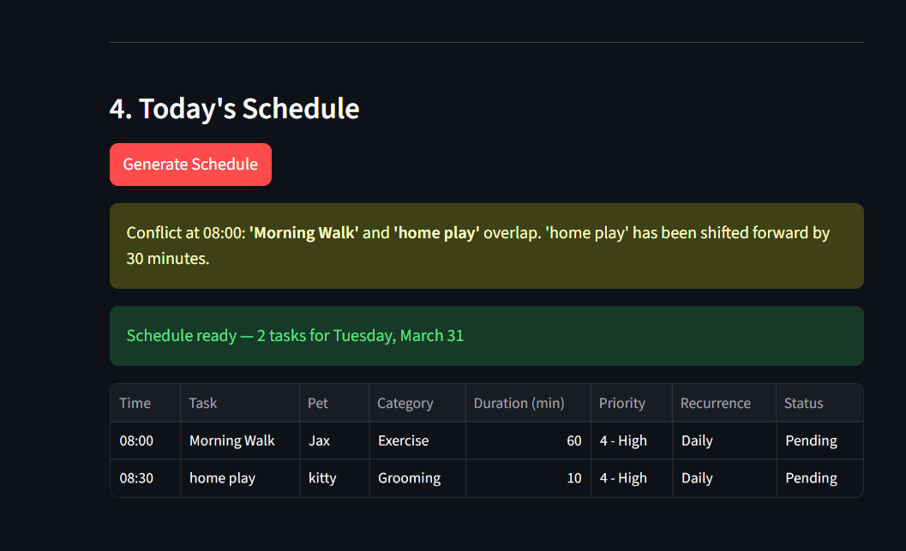

# PawPal+ 🐾

A smart pet care scheduling assistant built with Python and Streamlit. PawPal+ helps busy pet owners stay consistent with daily routines by generating an intelligent, conflict-free care plan for all their pets.

---

## 📸 Demo









---

## Features

- **Owner & pet management** — Register an owner with a daily time budget and add multiple pets with species and age info
- **Task scheduling** — Create care tasks (walks, feeding, medication, grooming, enrichment) with time, duration, priority, and recurrence
- **Sorting by time and priority** — The daily plan is always displayed in chronological order; ties are broken by priority level
- **Filtering** — Filter the schedule by pet name or completion status to focus on what matters
- **Recurring task automation** — Daily and weekly tasks automatically spawn a new instance for the next occurrence when marked complete
- **Conflict detection and resolution** — Tasks scheduled at the same time are flagged with a warning and the lower-priority one is shifted forward by 30 minutes
- **Plan explanation** — Every generated schedule includes a plain-language explanation of why each task was placed where it was

---

## System Architecture

The app is built around four Python classes:

| Class | Responsibility |
|---|---|
| `Task` | Represents a single care activity with time, priority, duration, and recurrence |
| `Pet` | Stores pet details and owns a list of tasks |
| `Owner` | Manages multiple pets and provides a daily time budget |
| `Scheduler` | Builds the daily plan by sorting, filtering, detecting conflicts, and handling recurrence |

See `uml_final.png` for the full class diagram.

---

## Getting Started

### Setup

```bash
python -m venv .venv
source .venv/bin/activate  # Windows: .venv\Scripts\activate
pip install -r requirements.txt
```

### Run the app

```bash
streamlit run app.py
```

### Run the CLI demo

```bash
python main.py
```

---

## Testing PawPal+

```bash
python -m pytest
```

The test suite covers 6 behaviors:

- **Task completion** — verifies `mark_complete()` correctly updates the task status
- **Task addition** — verifies adding a task to a pet increases the task count
- **Sorting correctness** — verifies tasks added out of order are returned in chronological order
- **Recurrence logic** — verifies that marking a daily task complete auto-creates a new task due the following day
- **Conflict detection** — verifies that two tasks scheduled at the same time are flagged as a conflict
- **Edge case: empty pet** — verifies the scheduler returns an empty list for a pet with no tasks, without crashing

**Confidence Level: ★★★★☆** — Core scheduling behaviors are well covered. The main gap is duration-based overlap detection, which is a known tradeoff documented in `reflection.md`.

---

## Smarter Scheduling

PawPal+ goes beyond a simple task list with four algorithmic features built into the `Scheduler` class:

- **Sorting by time and priority** — Tasks are always displayed in chronological order. When two tasks share the same time slot, the higher-priority task appears first.
- **Filtering** — The schedule can be filtered by pet name or completion status, so owners can focus on one pet at a time or see only what still needs to be done.
- **Recurring task automation** — When a daily or weekly task is marked complete, a new instance is automatically created for the next occurrence using Python's `timedelta`. The owner never has to re-enter repeating tasks.
- **Conflict detection and resolution** — If two tasks are scheduled at the same time, the system warns the owner with the names of the conflicting tasks and automatically shifts the lower-priority one forward by 30 minutes.

---

## Project Structure

```
pawpal-starter/
├── app.py               # Streamlit UI
├── pawpal_system.py     # Backend logic (Task, Pet, Owner, Scheduler)
├── main.py              # CLI demo script
├── tests/
│   └── test_pawpal.py   # Automated test suite
├── uml_final.png        # Final UML class diagram
├── reflection.md        # Design and AI collaboration reflection
└── requirements.txt
```
