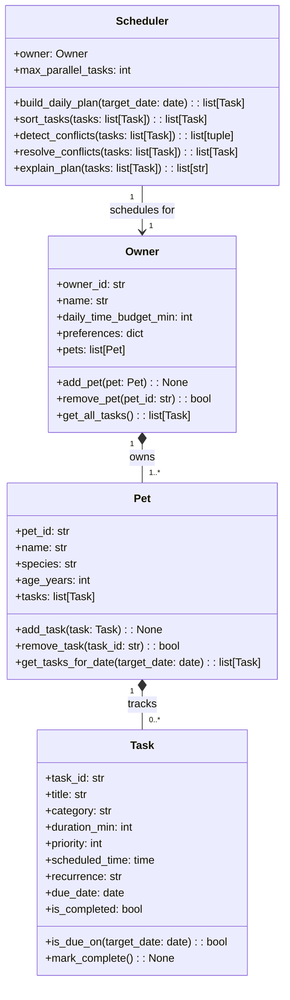

```mermaid
classDiagram
    class Owner {
        +owner_id: str
        +name: str
        +daily_time_budget_min: int
        +preferences: dict
        +pets: list[Pet]
        +add_pet(pet: Pet): None
        +remove_pet(pet_id: str): bool
        +get_all_tasks(): list[Task]
    }

    class Pet {
        +pet_id: str
        +name: str
        +species: str
        +age_years: int
        +tasks: list[Task]
        +add_task(task: Task): None
        +remove_task(task_id: str): bool
        +get_tasks_for_date(target_date: date): list[Task]
    }

    class Task {
        +task_id: str
        +title: str
        +category: str
        +duration_min: int
        +priority: int
        +scheduled_time: time
        +recurrence: str
        +due_date: date
        +is_completed: bool
        +is_due_on(target_date: date): bool
        +mark_complete(): None
    }

    class Scheduler {
        +owner: Owner
        +max_parallel_tasks: int
        +build_daily_plan(target_date: date): list[Task]
        +sort_tasks(tasks: list[Task]): list[Task]
        +detect_conflicts(tasks: list[Task]): list[tuple]
        +resolve_conflicts(tasks: list[Task]): list[Task]
        +explain_plan(tasks: list[Task]): list[str]
    }

    Owner "1" *-- "1..*" Pet : owns
    Pet "1" *-- "0..*" Task : tracks
    Scheduler "1" --> "1" Owner : schedules for
```
